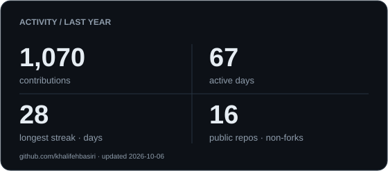
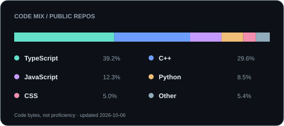

<picture>
  <source media="(prefers-color-scheme: dark)" srcset="assets/banner-dark.svg">
  <source media="(prefers-color-scheme: light)" srcset="assets/banner-light.svg">
  
</picture>

  <a href="https://kbasiri.com">the portfolio</a> &nbsp; / &nbsp;
  <a href="https://www.linkedin.com/in/khalifeh-basiri/">the professional version</a> &nbsp; / &nbsp;
  <a href="mailto:khalifa7k@gmail.com">say hello</a>

Most of my projects start with **“I wish there was a tool for this.”**

This is where I try ideas, follow rabbit holes, and turn what I learn into useful software—from full-stack apps to AI experiments.

I'm working toward becoming an **AI engineer**, focused on turning existing models into useful applications. Most of my experiments involve LLMs, and I'm also exploring machine learning.

## The commit trail

  <picture>
    <source media="(prefers-color-scheme: dark)" srcset="assets/stats-dark.svg">
    <source media="(prefers-color-scheme: light)" srcset="assets/stats-light.svg">
    
  </picture>
  <picture>
    <source media="(prefers-color-scheme: dark)" srcset="assets/languages-dark.svg">
    <source media="(prefers-color-scheme: light)" srcset="assets/languages-light.svg">
    
  </picture>

<picture>
  <source media="(prefers-color-scheme: dark)" srcset="assets/snake-dark.svg">
  <source media="(prefers-color-scheme: light)" srcset="assets/snake-light.svg">
  
</picture>

Activity over the last year · language mix by code bytes · refreshed daily

## A few tabs I always have open

`an AI experiment` &nbsp; `something I'm debugging` &nbsp; `something I'm building`

Right now, the workbench has [ZDash](https://www.zdash.app/) on it. The other experiments live in the repos below.

<picture>
  <source media="(prefers-color-scheme: dark)" srcset="assets/offline-dark.svg">
  <source media="(prefers-color-scheme: light)" srcset="assets/offline-light.svg">
  
</picture>

---

Browse around. If something sparks an idea, <a href="mailto:khalifa7k@gmail.com">let's talk</a>.

